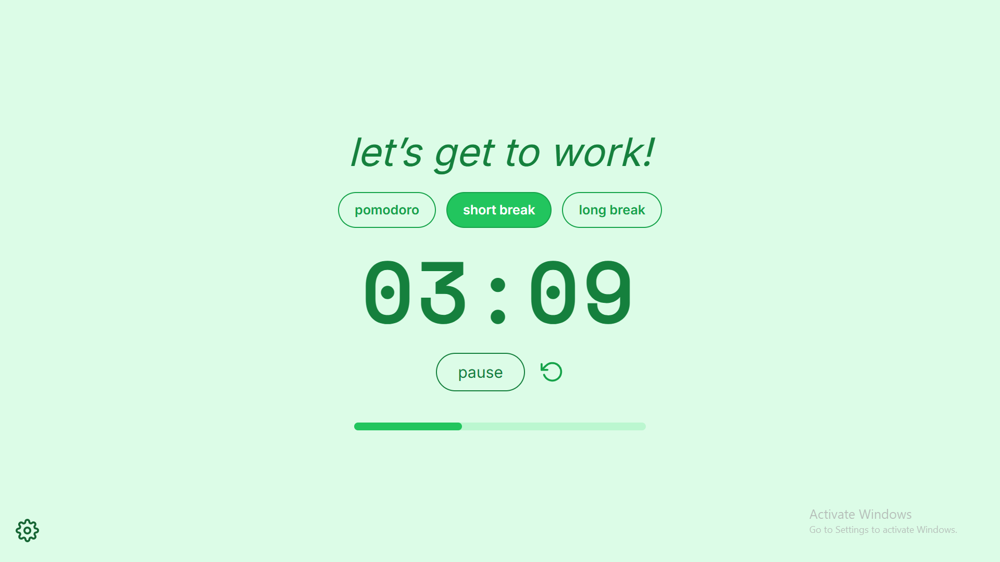

# ⏰ ADHD Friendly Pomodoro Timer

A clean, responsive, and ADHD-friendly Pomodoro Timer built with **React.js** and **Tailwind CSS**. Designed to help you stay focused while providing gentle break reminders with friendly visuals.



---

## ✨ Features

- 🎯 **Pomodoro Mode**, **Short Break**, and **Long Break**
- 🔔 Auto-switch between focus and break sessions
- 💬 Custom modal notification with coffee icon
- 💻 Responsive layout for all screen sizes
- 🎨 Built with Tailwind CSS for rapid customization
- ☕ Feather Icons for lightweight visuals

---

## 📦 Tech Stack

- [React.js](https://reactjs.org/)
- [Tailwind CSS](https://tailwindcss.com/)
- [React Feather Icons](https://github.com/feathericons/react-feather)

---

## 🚀 Getting Started

```bash
# 1. Clone the repo
git clone https://github.com/YOUR_USERNAME/najuu-s-pomodoro.git
cd najuu-s-pomodoro

# 2. Install dependencies
npm install

# 3. Run development server
npm run dev   # if using Vite
# or
npm start     # if using Create React App
